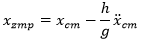
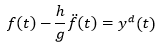
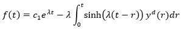
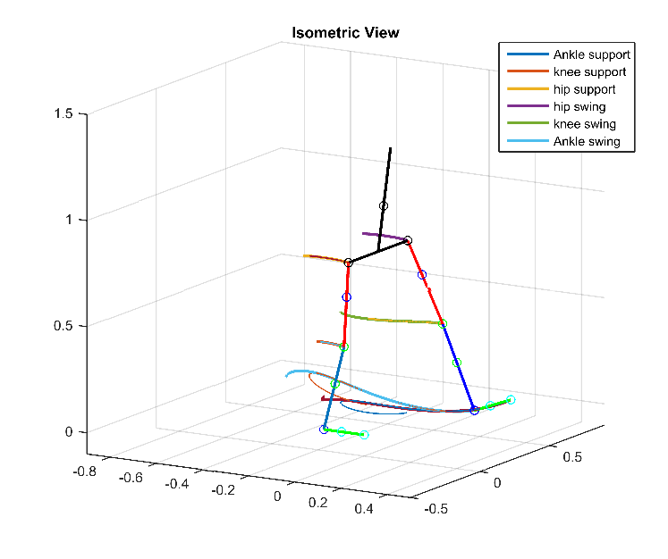

# ZMP-explicit-LQR
A ZMP approach based on explicit LQR tracking and task space for the walking of a lower-limb rehabilitation exoskeleton

The most important part of the research is in pages 3-4, specifically subsection V.B. Trajectory Tracking for Center of Mass. In summary, we propose to don't track directly the ZMP by the output "y", but instead track the center of mass trajectory, explicitly solving the ZMP differential equation, removing the unstable term, and tracking directly the coordinates of the center of mass. The rest of the paper is a very particular application to a lower-limb rehabilitation exoskeleton.

So we have the classic zmp equation under the consideration of constant angular momentum and constant height of center of mass:

Instead of tracking y as xzmp as the paper we based on (final of Readme), we simply solve the equation. Actually it is possible to get a closed form solution form it, always that the zmp trajectory times an exponential will be integrable. In fact we have: 

So, in particular, for all piecewise polynomial trajectory of the center of mass, we have a function of the center of mass that makes the zmp perfectly. This fact is well-known in literature, in fact, there are infinite solutions from it, but almost all of them are unstable because of the positive pole of the differential equation. The little problem is find the solution that donesn't have that unstable exponential term, which is basically find the unique constant c1 that gives us the stable trajectory of center of mass.

As I said before, the rest of the paper is about a lower-limb rehabilitation exoskeleton.

Abstract

This study presents the control law based on ZMP and LQR for a biped robot or a rehabilitation exoskeleton. The model is presented as a 7-link system with six actuated joints. The kinematics and dynamics analysis was divided into two parts: serial and parallel. The system was linearized using Task Space feedback linearization method, and trajectory tracking optimal control was de-signed using the LQR control strategy in the ZMP by directly controlling the CoM, solving the differential equation, finding CoM trajectories, and deleting the unstable terms. In contrast to another common methods, our approaches works relatively nice, and it’s a good way to generalize ZMP trajectories, no necessarily polynomials as is usually done. Simulations were performed in a virtual reality environment with human body inertial parameters obtained from previous studies and references by video recording analysis.

Inspired on: “A closed-form solution for real-time ZMP gait generation and feedback sabilization” - R. Tedrake et. al. https://ieeexplore.ieee.org/document/7363473/
